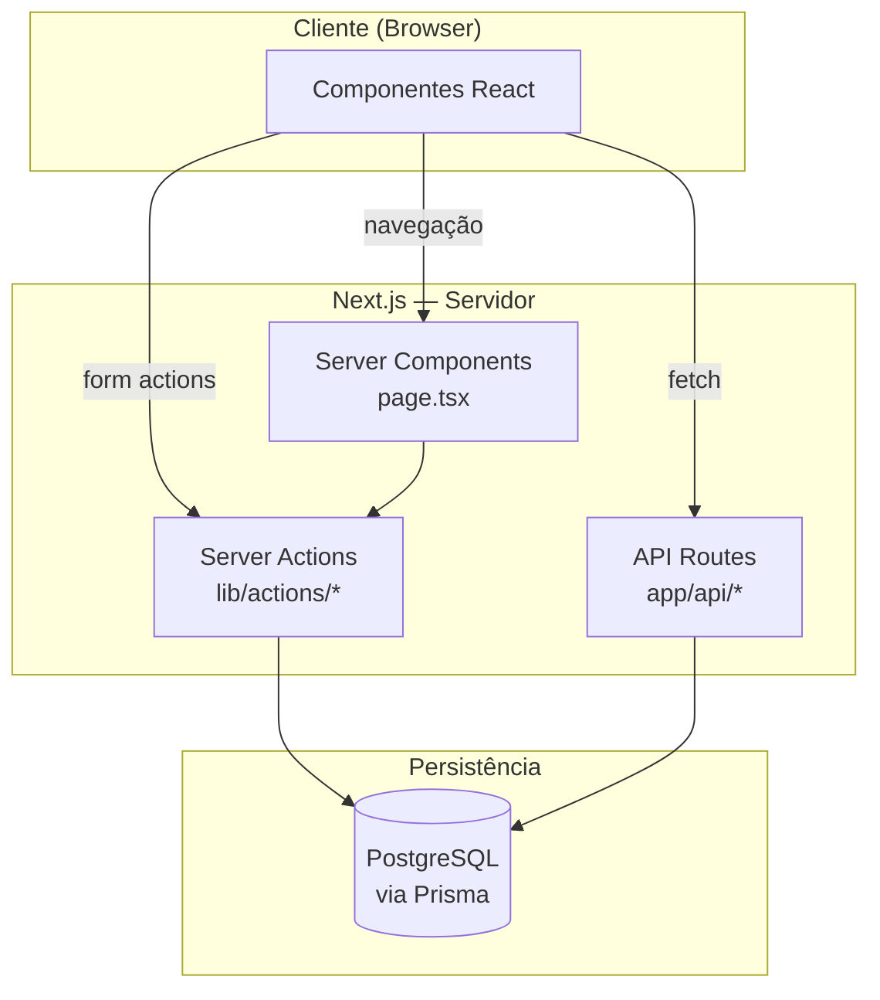
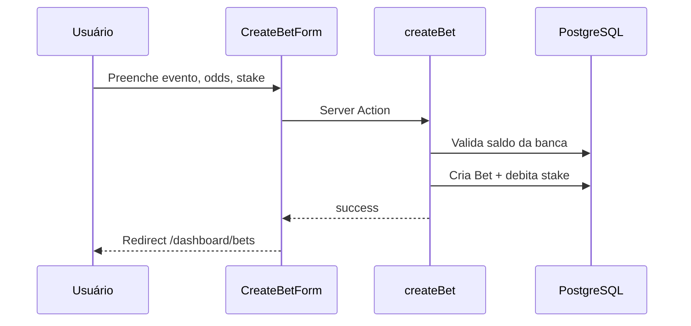

# Fluxos de Backend — Betting Control

Documento de referência dos fluxos de dados no servidor: **requisições HTTP internas** (`/api/*`) e **Server Actions** (`"use server"`).

> **Stack:** Next.js 15 App Router · Prisma · PostgreSQL · NextAuth v5  
> **Última atualização:** 2026-06-18

---

## Visão geral da arquitetura

---

## Módulos principais

| Módulo | Server Actions | Descrição |
|--------|----------------|-----------|
| Autenticação | `auth.ts` | Login, registro, logout |
| Bancas | `bankroll.ts` | CRUD de bancas |
| Transações | `transaction.ts` | Depósitos e saques |
| Apostas | `bet.ts` | CRUD e liquidação de apostas |
| Mercados | `market.ts` | Cadastro de mercados |
| Estatísticas | `stats.ts` | ROI, win rate, gráficos do dashboard |

---

## Fluxo: criar aposta

---

## Mapa de endpoints

| Método | Rota | Autenticação | Função |
|--------|------|--------------|--------|
| * | `/api/auth/[...nextauth]` | Público | NextAuth handlers |
| GET/POST | `/api/markets` | Sessão | Listar/criar mercados |

---

## Modelos de dados

- **User** → **Bankroll** → **Bet**, **Transaction**
- **Market** → **Bet**
- Campos de aposta: `event`, `competition`, `sport`, `odds`, `stake`, `status`, `result`
